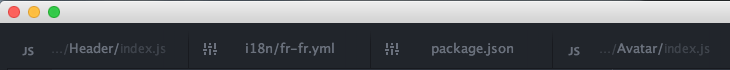
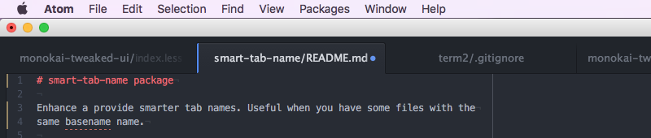

# smart-tab-name

> Provide smarter tab names form Atom editor.

Useful when you have some files with the same basename name.  
Auto adjust paths if you have multiples folders in the same window to bring
you some context.

## Preview

### One folder preview

### Multiples folder preview

## [CHANGELOG](CHANGELOG.md)

## [License](LICENSE.md)
